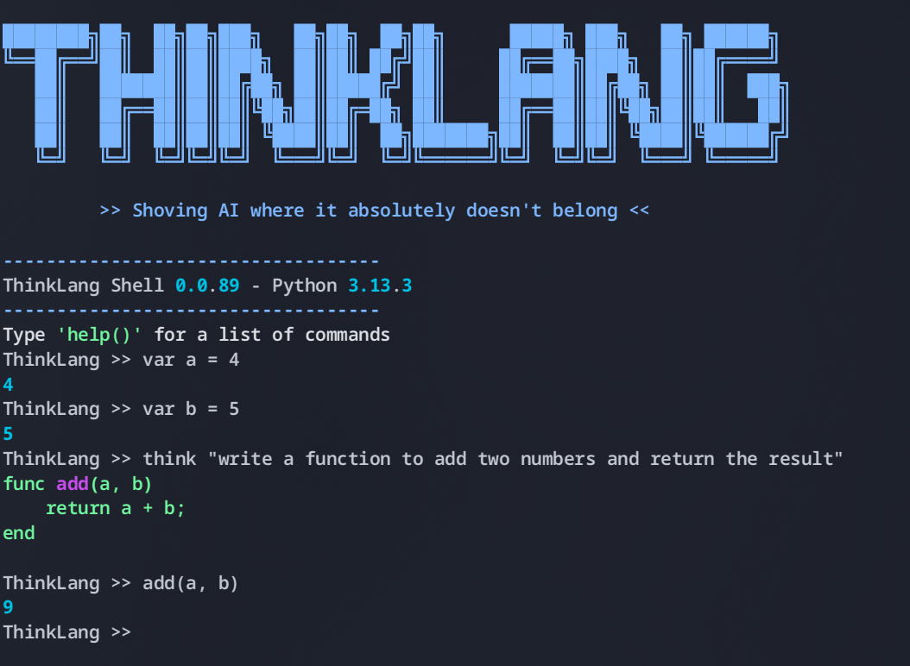

# ThinkLang



As everyone seems to be using AI in every field imaginable (even when it doesn't make sense), this is my pathetic little attempt to fit in. Behold, in all its futile glory, ThinkLang, a programming language with AI baked in right at the interpreter level.

Ever bored of your source code being deterministic? Want to spice things up for your production builds so that you're always on your toes? Now you can do that and more, as you leave the execution of your code to an AI, which will shameless write code in places you have asked it to, only for it to _sometimes_ fail.

If you're lazy to code a chunk of code, just use the inbuilt keyword `think` and a prompt right in your code, so that the AI picks up and executes what it thinks is right.

## I'm impressed, how do I get started?

Well if you've made it this far, you either have way too much time on your hands, or you're a masochist. Anyway, here's how you run this locally:

### Prerequisites
Just have python installed. If you fancy, create and start a virtual environment so that you don't end up installing pytorch and huggingface globally.

- Clone this repo.
- Install all the dependencies mentioned in the requirements file. Be aware that running this program for the first time downloads an AI model off of huggingface.
```bash
pip install -r requirements.txt
```
- Run the ThinkLang shell for an interactive and mildly infuriating experience
```bash
python think.py
``` 
If you're already ahead and want to run a ThinkLang script, then just specify the path.
```bash
python think.py test.think
```

Remember, if this doesn't work or gives you the wrong output, then try again. Who knows, it will run just fine eventually.

## Hall of fame
If you use this joke of a language in production, your name will be featured here.